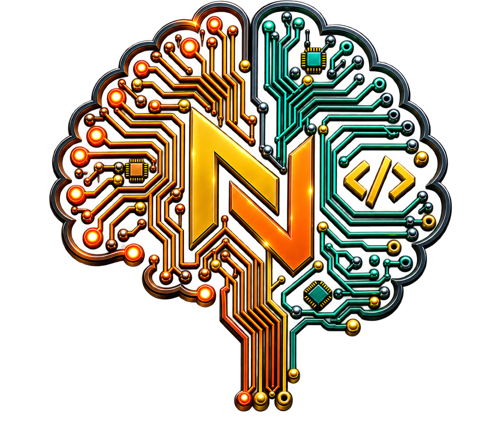
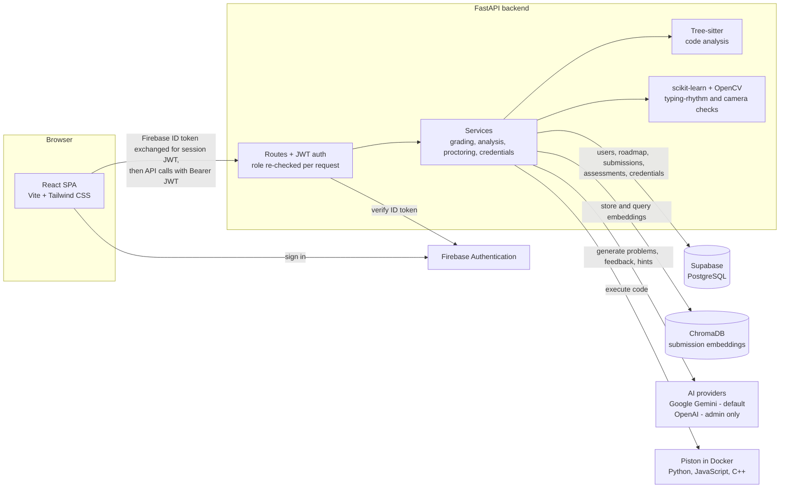
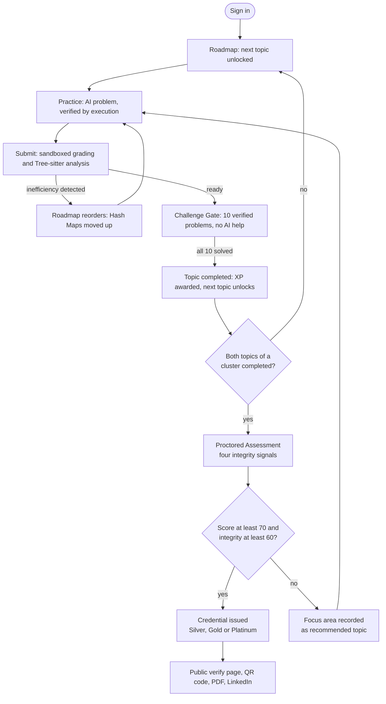
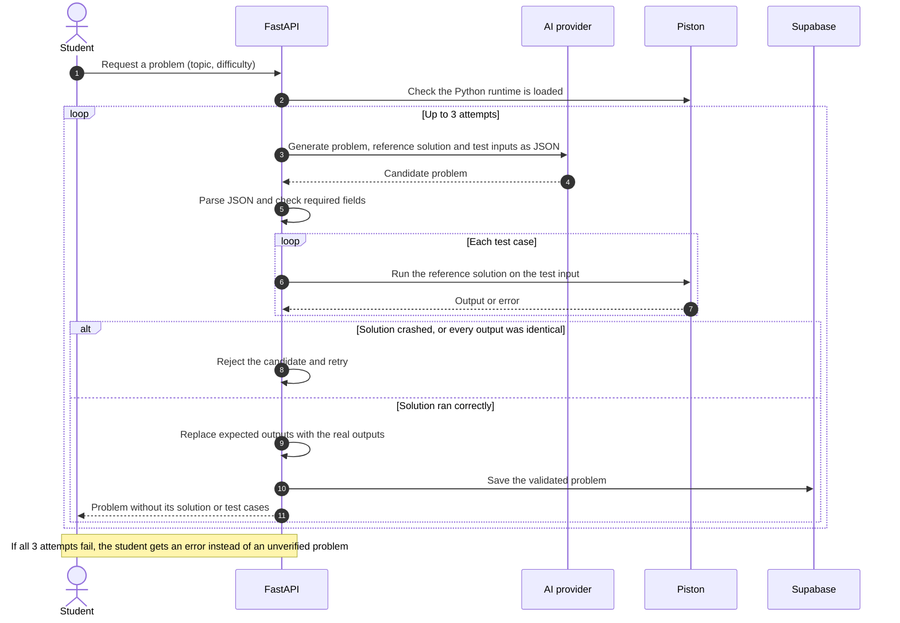

<!--
  Root README. Everything below features, architecture diagrams, file
  structure was written from the actual code and repository layout.
-->

<div align="center">



# NeuroCode

### Where Intelligence Meets Code

An AI-powered coding education platform that connects adaptive learning, real code execution,
proctored assessment and verifiable credentials in one system.

<!-- Live preview is now deployed on Netlify (frontend only; see Getting Started). -->
[](https://neurocode-official.netlify.app/)


**Live preview:** [neurocode-official.netlify.app](https://neurocode-official.netlify.app/)

</div>

---

## About

NeuroCode guides a student from their first topic to a credential anyone can check. An **adaptive
roadmap** orders ten data structures and algorithms topics and reorders itself when the code analyzer
spots a weakness. **AI-generated practice problems** are only shown after their reference solution has
been **executed and verified** in a sandbox. Submissions in Python, JavaScript and C++ are graded
against real test cases and analyzed structurally with Tree-sitter. **Proctored assessments** combine
test results with four behavioral integrity signals scored on the server, and passing one issues a
**tiered credential** with a public verification page, QR code, PDF export and LinkedIn sharing.

## Watch It In Action

[](https://youtu.be/S7R6AE9nWps)
[](https://youtu.be/LMY99wXn-QE)

- **Full platform walkthrough:** https://youtu.be/S7R6AE9nWps
- **Quick live demo:** https://youtu.be/LMY99wXn-QE

## Documentation

| Document | What's inside |
|---|---|
| [Documentation](docs/DOCUMENTATION.md) | Complete student, educator and admin guide to every module |
| [Setup & Deployment](docs/SETUP_AND_DEPLOYMENT.md) | Run the full platform on your own machine, and how it maps to production |
| [Demo Mode presenter script](docs/demo.md) | The fixed, pre-verified walkthrough used for live demonstrations |
| [Brand Logo Rationale](docs/BRAND_LOGO_RATIONALE.md) | The design and meaning behind the NeuroCode mark |

## The Problem NeuroCode Addresses

Common programming-practice and assessment tools tend to solve one piece of the learning path in
isolation. NeuroCode was built around closing the gaps between those pieces:

| Gap | How NeuroCode addresses it |
|---|---|
| **Fixed problem banks** can be memorized, and solutions shared. | Problems are generated fresh per request. |
| **AI-generated content can be wrong** a model can write a plausible solution that doesn't actually work. | Every generated problem's reference solution is executed in a sandbox first, and the real outputs become the expected answers. |
| **Pass/fail judges say little about how code is written.** | Tree-sitter analysis estimates complexity and flags inefficient patterns, with written feedback. |
| **Learning paths are static.** | The roadmap reorders itself from detected weaknesses and suggests the next topic from recent struggles. |
| **AI tutors can simply hand out answers.** | The learning assistant is hint-only: direct-answer requests are refused before the AI is called, and hints are grounded in the student's own past submissions. |
| **Online assessments rely on trust.** | Four integrity signals (tab switching, large pastes, camera checks, typing rhythm) are logged and scored on the server; low-integrity attempts are flagged. |
| **Certificates are hard to verify.** | Each credential has a public verification page and QR code that anyone can check without an account. |

## Architecture

### System overview



### Student journey



### Generate, then verify by execution

AI output is never trusted on its own. A generated problem is only saved and shown once its reference
solution has actually run.



## Tech Stack


These technologies have no logo available on shields.io:

| Technology | Role in NeuroCode |
|---|---|
| **ChromaDB** | Vector store for submission embeddings powers the hint assistant's context and topic recommendations |
| **OpenAI** | Optional, admin-only AI provider for problem generation |
| **Tree-sitter** | Parses submitted code into a syntax tree for complexity and anti-pattern analysis |

## Project Structure

```
NueroCode-Official/
├── backend/                 FastAPI backend
│   ├── app/
│   │   ├── ai/              AI provider abstraction (Gemini, OpenAI) and Tree-sitter code analysis
│   │   ├── config/          Environment-driven settings
│   │   ├── database/        Supabase repositories and ChromaDB client
│   │   ├── demo/            Fixed Demo Mode content, its verification script and doc generator
│   │   ├── middleware/      Session-token authentication and role checks
│   │   ├── routes/          API routers (auth, roadmap, problems, submissions, assessments, admin, …)
│   │   ├── schemas/         Pydantic request and response models
│   │   ├── services/        Business logic: generation, grading, analysis, proctoring, credentials
│   │   ├── utils/           JWT helpers and AI-provider access checks
│   │   ├── constants.py
│   │   └── main.py          Application entry point
│   ├── .env.example
│   └── requirements.txt
├── database/
│   └── schema/              Numbered SQL migrations, applied in order
├── docs/                    Documentation, setup guide, Demo Mode script, brand rationale
├── frontend/                React + Vite frontend
│   ├── public/              Favicons
│   ├── src/
│   │   ├── assets/          Logo mark
│   │   ├── components/      UI components (landing, editor, assessment, layout, common, …)
│   │   ├── context/         Auth, theme and Demo Mode state
│   │   ├── hooks/           Proctoring detectors (tab visibility, paste, keystroke rhythm)
│   │   ├── lib/             Firebase client and utilities
│   │   ├── pages/           Route pages
│   │   ├── routes/          Route definitions
│   │   ├── services/        API clients
│   │   ├── styles/          Landing page styles
│   │   └── utils/           Auth error messages, certificate export and sharing
│   ├── .env.example
│   ├── netlify.toml         Netlify build settings and SPA rewrite
│   └── package.json
├── LICENSE
└── README.md
```

`backend/tests/`, `database/migrations/`, `database/seed/`, `scripts/` and `tests/` are reserved,
currently empty placeholders.

## Getting Started

The [live preview](https://neurocode-official.netlify.app/) is frontend-only. To run the complete platform, follow
**[docs/SETUP_AND_DEPLOYMENT.md](docs/SETUP_AND_DEPLOYMENT.md)**. You'll need Docker, Python 3.11,
Node.js 18+, and free Supabase, Firebase and Gemini accounts.

## Open Source

NeuroCode is open source under the [MIT License](LICENSE) if you'd like to explore the code,
contribute, or just say hi, you're always welcome. Explorers, issue reports and pull requests are all
encouraged.

---

<div align="center">

**Built by Muhammad Ibrahim.**

</div>

---

<!-- Standard closing line on every NeuroCode doc. -->
<div align="center">

© 2026 NeuroCode

</div>
