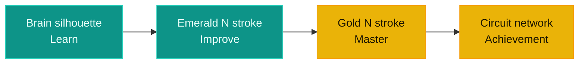

  

  

  
  
  
  

 

  
   
  

 ## Contents

1. [Overall composition](#1-overall-composition)
2. [Component-by-component breakdown](#2-component-by-component-breakdown)
3. [Why this direction fits NeuroCode specifically](#3-why-this-direction-fits-neurocode-specifically)

  

## 1. Overall composition

The mark reads left-to-right as a single visual sentence: a biological brain feeding into a bicolor monogram, which feeds into a network of achievement nodes. That left-to-right flow isn't decorative — it's a direct visual translation of `DESIGN_SYSTEM.md`'s stated core philosophy for the whole product:

<b>Learn → Improve → Master</b>

The brain represents **Learn**, the emerald half of the N represents **Improve** (active coding/practice), and the gold half plus its circuit network represents **Master** (achievement, credentialing). The logo is effectively a compressed diagram of the product's own user journey, not just a brandmark.

  

## 2. Component-by-component breakdown

### Quick reference

| # | Element | Color | Core symbolism |
|---|---|---|---|
| a | Brain silhouette | Emerald outline | AI as mentor, not authority |
| b | Circuit traces (filled nodes) | Emerald | Neuro + Code fused in one shape |
| c | `</>` bracket | Emerald | Instant "this is a coding platform" cue |
| d | Bicolor N monogram | Emerald → Gold | Progress bar: learning to mastery |
| e | Circuit network (open rings) | Gold | Earned, structured achievement |

---
### a) The brain silhouette (far left, emerald outline)

A rounded, organic, cloud-like brain outline — deliberately soft and friendly rather than sharp or robotic.

> **Why it matters:** `BRANDING.md §7` (AI Experience) is explicit that "Artificial Intelligence should always feel like a mentor, not a replacement" and should "encourage learning" and "maintain an educational focus." A jagged, mechanical, Terminator-style brain would communicate AI-as-authority. A soft, rounded, hand-drawn-feeling lobe communicates AI-as-mentor — approachable intelligence, not a black-box algorithm grading you.

### b) The circuit traces inside the brain (small filled nodes)

Thin right-angled lines terminating in small filled emerald circles, running through the brain like a simplified PCB trace or neuron pathway.

> **Why it matters:** This is the most literal piece of symbolism in the mark — it fuses *neuro* (biological cognition) with *code* (electronic computation) inside a single shape, rather than placing a brain next to a chip as two separate icons. That fusion is the whole thesis of the platform: NeuroCode doesn't just teach code, it uses AI (Tree-sitter AST analysis, ChromaDB RAG, adaptive ML recommendations — per `AI_ML_IMPLEMENTATION_PLAN.md`) to understand *how* a student thinks, not just *what* they typed. The filled nodes read as "activated" — knowledge that has already been acquired and fired.

