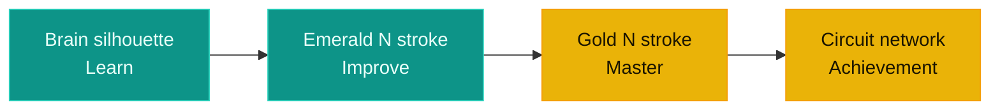

  

  

  
  
  
  

 

  
   
  

## Contents

1. [Overall composition](#1-overall-composition)
2. [Component-by-component breakdown](#2-component-by-component-breakdown)
3. [Why this direction fits NeuroCode specifically](#3-why-this-direction-fits-neurocode-specifically)

  

## 1. Overall composition

The mark reads left-to-right as a single visual sentence: a biological brain feeding into a bicolor monogram, which feeds into a network of achievement nodes. That left-to-right flow isn't decorative — it's a direct visual translation of `DESIGN_SYSTEM.md`'s stated core philosophy for the whole product:

<b>Learn → Improve → Master</b>

The brain represents **Learn**, the emerald half of the N represents **Improve** (active coding/practice), and the gold half plus its circuit network represents **Master** (achievement, credentialing). The logo is effectively a compressed diagram of the product's own user journey, not just a brandmark.

  

## 2. Component-by-component breakdown

### Quick reference

| # | Element | Color | Core symbolism |
|---|---|---|---|
| a | Brain silhouette | Emerald outline | AI as mentor, not authority |
| b | Circuit traces (filled nodes) | Emerald | Neuro + Code fused in one shape |
| c | `</>` bracket | Emerald | Instant "this is a coding platform" cue |
| d | Bicolor N monogram | Emerald → Gold | Progress bar: learning to mastery |
| e | Circuit network (open rings) | Gold | Earned, structured achievement |

---

### a) The brain silhouette (far left, emerald outline)

A rounded, organic, cloud-like brain outline — deliberately soft and friendly rather than sharp or robotic.

> **Why it matters:** `BRANDING.md §7` (AI Experience) is explicit that "Artificial Intelligence should always feel like a mentor, not a replacement" and should "encourage learning" and "maintain an educational focus." A jagged, mechanical, Terminator-style brain would communicate AI-as-authority. A soft, rounded, hand-drawn-feeling lobe communicates AI-as-mentor — approachable intelligence, not a black-box algorithm grading you.

### b) The circuit traces inside the brain (small filled nodes)

Thin right-angled lines terminating in small filled emerald circles, running through the brain like a simplified PCB trace or neuron pathway.

> **Why it matters:** This is the most literal piece of symbolism in the mark — it fuses *neuro* (biological cognition) with *code* (electronic computation) inside a single shape, rather than placing a brain next to a chip as two separate icons. That fusion is the whole thesis of the platform: NeuroCode doesn't just teach code, it uses AI (Tree-sitter AST analysis, ChromaDB RAG, adaptive ML recommendations — per `AI_ML_IMPLEMENTATION_PLAN.md`) to understand *how* a student thinks, not just *what* they typed. The filled nodes read as "activated" — knowledge that has already been acquired and fired.

### c) The `</>` code bracket

Sitting directly above the monogram, rendered in the same emerald gradient as the brain.

> **Why it matters:** It's the one universally-recognized glyph for "this is about programming," included specifically so the mark doesn't rely on the brain alone to signal "coding platform" — someone glancing at it for half a second gets both halves of the name (Neuro + Code) without needing to read the wordmark.

### d) The bicolor "N" monogram (the center of the mark)

A single N-shape, split down the middle: emerald on the left stroke, gold on the right stroke.

> **Why it matters:** This is the most deliberate piece of the whole design, because the split isn't arbitrary — it uses the exact same color-to-meaning mapping already locked into `DESIGN_SYSTEM.md` for the entire application:

| Color | Semantic meaning | Position |
|---|---|---|
|  **Emerald** | Learning, Progress, AI, Coding, Success | Left stroke — closer to the brain |
|  **Gold** | Mastery, Achievement, Excellence, Recognition | Right stroke — closer to the achievement network |

In other words, the logo doesn't introduce a separate color language for branding — it's the same semantic rule the dashboard, XP system, and certificates already follow (`DESIGN_SYSTEM.md`: *"Gold should only appear for Achievements, XP, Levels, Certificates... Gold must feel earned"*). A single letterform carrying both colors makes the N itself a miniature progress bar: you literally start on the emerald (practice/learning) side and arrive at the gold (mastery/credential) side.

### e) The gold circuit network (far right, open/ring nodes)

Mirrors the brain's circuit pattern on the opposite side, but with two intentional differences: it's gold, not emerald, and its nodes are open rings, not filled dots.

> **Why it matters:** The mirroring is the point — it visually asserts that mastery is structured and earned the same way learning is (a network, not a single trophy). The open-ring nodes (versus the brain's filled dots) read as unfilled slots waiting to be completed — a natural stand-in for badges, certificates, and skill nodes on a roadmap that haven't been unlocked yet. That maps directly onto the platform's actual credentialing feature: a verifiable, QR-coded skill map where nodes light up as they're mastered.

  

## 3. Why this direction fits NeuroCode specifically

A generic "coding bootcamp" logo (laptop, terminal cursor, angle brackets alone) would say "we teach code." This mark says something narrower and truer to what's actually being built:

- **It encodes the AI-native premise, not just the subject matter.** The brain isn't a decorative flourish next to the name — it's structurally fused into the monogram, matching the platform's core differentiator (adaptive AI that analyzes how students solve problems, not just pass/fail).
- **It encodes the gamification + credentialing system** the FYP proposal identifies as the differentiator. The proposal's problem statement is that practice performance never carries into formal, recruiter-trusted assessment. The logo's own two-tone structure — practice (emerald) flowing into a verified, earned network (gold) — is a visual echo of that exact pipeline.
- **It's consistent with the brand personality already defined before the logo existed.** `BRANDING.md §3` calls for Premium, Modern, Minimal, Confident, Clean — the mark is a single connected silhouette with no clutter, no gradients beyond the two brand colors, and no ornamental elements outside the emerald/gold pairing already governing every other screen in the product.
- **It reuses zero new colors.** Every color in the mark — both emeralds, both golds — is already an official token in `DESIGN_SYSTEM.md`. Nothing about the logo requires the design system to bend around it; it was built from the same palette the rest of the app already speaks.

### Brand personality checklist

| `BRANDING.md §3` requirement | How the mark satisfies it |
|---|---|
| Premium | No clutter, restrained two-color palette |
| Modern | Circuit-node motif, geometric monogram |
| Minimal | Single connected silhouette, no extra ornament |
| Confident | Bold monogram sits at dead center of the mark |
| Clean | Zero gradients beyond the two brand colors |

That's the practical reason it was the strongest candidate to finalize on: it isn't just aesthetically distinct, it's the one option where every visual element maps onto something the team had already decided the product is — an AI-native learning system where progress (emerald) is earned into verified mastery (gold).

  

  <i>Logo concept, visual design, and brand system by <b>Muhammad Ibrahim</b> — Team Lead, AbstractMinds</i>

  © 2026 AbstractMinds. All rights reserved. The NeuroCode name, logo, and wordmark are proprietary brand assets of AbstractMinds and may not be reproduced, modified, or redistributed without prior written permission.

  

